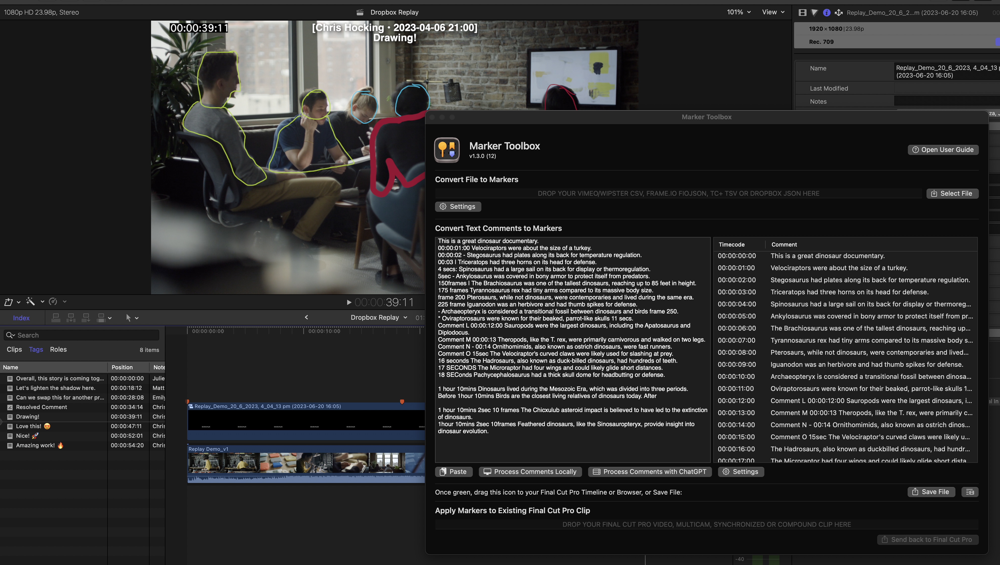

# Marker Toolbox

Marker Toolbox allows you to import a **Vimeo** `CSV`, **Wipster** `CSV`, **Dropbox Replay** `JSON`, **Frame.io** `FIOJSON`, **Timecode+** `TSV` & **Text Comments** into Apple's [Final Cut Pro](https://www.apple.com/final-cut-pro/), Blackmagic's [DaVinci Resolve](https://www.blackmagicdesign.com/products/davinciresolve){target="_blank"} and [Avid Media Composer](https://www.avid.com/media-composer){target="_blank"}.

You can even get OpenAI's **ChatGPT** to help interpret your Text Comments - which is perfect for handling emails from clients!

> [:icon-desktop-download: Click here to **buy** on the Mac App Store](/buy/)

If you're emailed a simple list of changes, you can use our powerful algorithm to transform this list into markers locally.

However, if you have a more complex email of conversational notes, you can get OpenAI's ChatGPT to help translate the email into markers!

You can even import a Clip, Multicam Clip, Compound Clip or Synchronised Clip from Final Cut Pro into Marker Toolbox, apply markers to it, and bring it back to Final Cut Pro!

You can learn more about how it works [here](/how-to-use/).