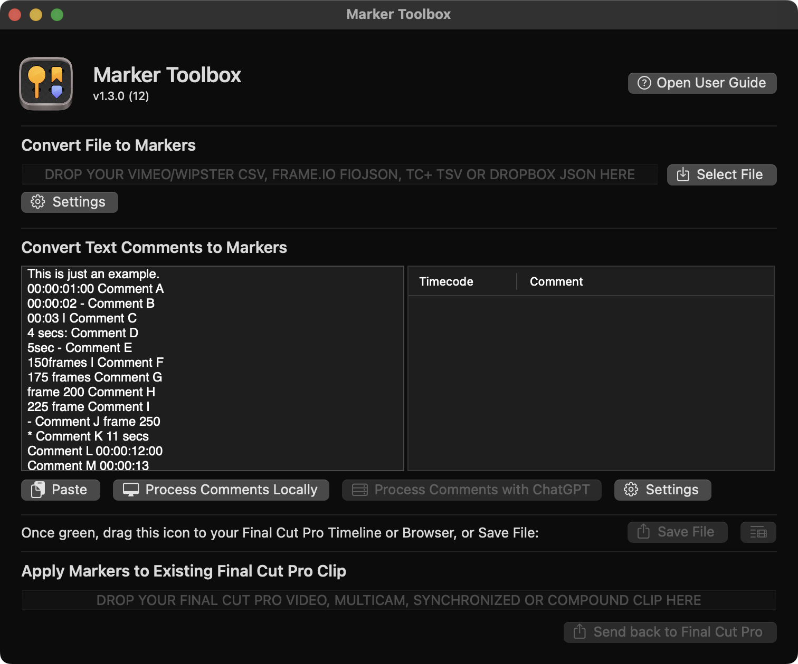
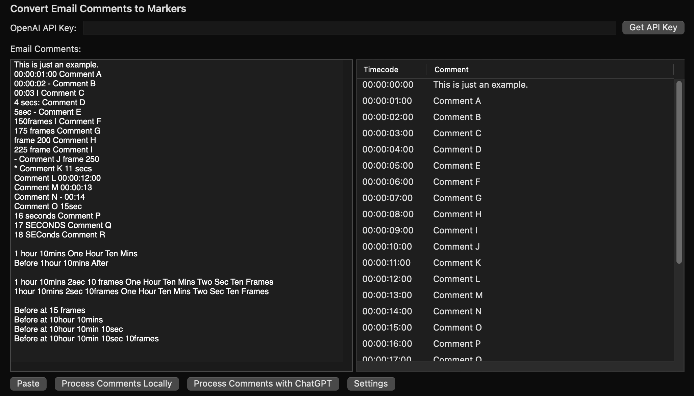

# How To Use

Once [installed](https://markertoolbox.io/installation/) you can access Marker Toolbox from the Workflow Extension button in Final Cut Pro:


...or via the **Window > Extensions** menubar:


The first time you launch Marker Toolbox it will look like this:



---

### Convert Vimeo CSV to Markers

This feature allows you to easily import Vimeo CSV files into Markers.

You can learn more about exporting CSV files from Vimeo [here](https://vimeo.zendesk.com/hc/en-us/articles/224818367-Video-review-page-).

This functionality has been built into [CommandPost](https://commandpost.io) for a while, however we've improved upon it based on user feedback.

Simply drag a CSV file into the drop zone, or click the **Select CSV** button:


Assuming the CSV is correct and valid, the draggable icon on the bottom of the interface will now be green:


You can now drag this green icon into your Final Cut Pro timeline or browser.

If you drag the icon to your timeline, a **Compound Clip** with all your markers will be added:


You can then use the **Clip > Break Apart Clip Items** menubar item to break the Compound Clip into individual markers:


This is handy because the individual markers will now be attached to the clips on the Primary Storyline, so that when you re-arrange clips, those markers will travel with them.


Back in the Workflow Extension there are three Marker Options:


These settings allow you to add the Username, Replies and Date Added to the Marker name within Final Cut Pro, and the Timeline Index:


---

### Convert Email Comments to Markers

This feature allows you to easily convert random email comments into Markers.

This is handy if your client refuses to use Vimeo Review or Frame.io, and sends email comments or text messages instead.

If the feedback is well organised, then you can use the **Process Comments Locally** button to easily translate any time values into timecode.



This process uses a very simple algorithm that supports time formats like:

```
hh:mm:ss:ff - Comment
mm:ss:ff - Comment
1 hour - Comment
1 hour 10mins 30secs 10frames - Comment
I really like the shot at 250 frames
Please remove the shot at 10 minutes
```

However, if you have a more complicated collection of feedback, you can use OpenAI's ChatGPT to process it. For example:


To use the ChatGPT functionality you'll need to have your own OpenAI API key.

You can find OpenAI's pricing [here](https://openai.com/pricing).

If you have a ChatGPT account, you can [get your API key here](https://platform.openai.com/account/api-keys).

Pressing the **Get API Key** button in the user interface, will open up the same above link.

Your API key is securely saved in [macOS's Keychain](https://support.apple.com/en-au/guide/keychain-access/kyca1083/mac).

The first time you enter in an API key and press **return** (or click away from the text box) you'll be presented with:


Depending on your security settings, you then may be prompted to enter your macOS password, so that Marker Toolbox can access the API stored in the Marker Toolbox can access the information stored within the **com.latenitefilms.MarkerToolbox.WorkflowExtension.APIKey** keychain item. Click **Always Allow**.


You can now use the **Process Comments with ChatGPT** button within Marker Toolbox to send email comments to ChatGPT.

Depending on OpenAI's server load, this process can happen quickly, or take a few minutes.


Once complete, like the **Convert Vimeo CSV to Markers** feature, you can now drag this green icon into your Final Cut Pro timeline or browser.


You can customise the ChatGPT Model, Frame Rate and Prompt by clicking the **Settings** button.


The default ChatGPT Model is **gpt-3.5-turbo**. If you have access to **gpt-4** or **gpt-4-32k** you can also select them.

You can learn more about the various ChatGPT models [here](https://platform.openai.com/docs/models).

The Frame Rate dropdown allows you to select the frame rate of your destination timeline/project. It's **25fps** by default.

Finally, you can customise the ChatGPT prompt as required.

The default prompt is:

> Your job is to transform emailed timecode notes from a client into a JSON file.
>
> You should only ever reply with the JSON output. No further comments or explanation is required.
>
> The JSON format should be as follows:
>
> [{"timestamp":"<Seconds>","comment":"<Comment>"},...]
>
> Any timecode value (i.e. "HH:MM:SS:FF" for hours, minutes, seconds and frames), should be converted into seconds.
>
> The frame rate of all timecode values, and frame values should be <FRAMERATE>.
>
> If another time value is described, you should make your best guess as to what that time value should be.
>
> For example, if I said the frame rate was 25fps, and the email said:
>
> 1sec: I really like this shot
> 00:00:02 Please remove this shot
> 1min 23sec Fix this window
> 5 minute mark - Remove the cat
> at ten minutes - Replace this shot
> on frame 1 add a sound effect here
> * i really like the shot at 6 seconds
> * something really cool happens 10 seconds later
> - insert monkey at 12 frames
>
> The output should be:
>
> [
> {"timestamp":"1", "comment":"I really like this shot"},
> {"timestamp":"2", "comment":"Please remove this shot"},
> {"timestamp":"83", "comment":"Fix this window"},
> {"timestamp":"300", "comment":"Remove the cat"},
> {"timestamp":"600", "comment":"Replace this shot"}
> {"timestamp":"0.04", "comment":"Add a sound effect here"}
> {"timestamp":"6", "comment":"I really like the shot"}
> {"timestamp":"16", "comment":"Something really cool happens"}
> {"timestamp":"0.48", "comment":"Insert monkey"}
> ]
>
> Please be careful about whether a timecode value is relative to the previous comment's timecode value (i.e. '10 seconds later') and calculate accordingly.
>
> If there is a general note with no timecode, use a 0 second timestamp value.
>
> Please process the below email:
>
> ```
> <COMMENT>
> ```

You must include both the **<FRAMERATE>** and **<COMMENT>** in the prompt.

Please be aware that ChatGPT can be fairly unpredictable, and each time you press the **Process Comments with ChatGPT** button you might slightly different results.