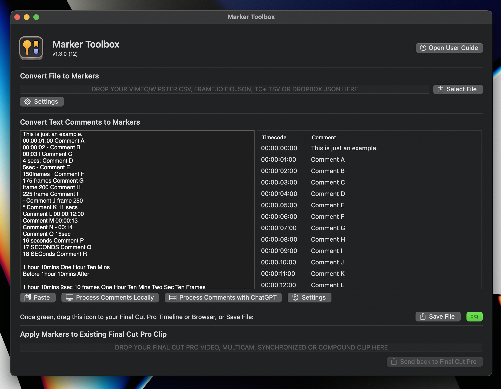

# Installation

To install **Marker Toolbox**, simply download it from the [Mac App Store](https://apps.apple.com/us/app/marker-toolbox/id6446810965){target="_blank"}, and open it once downloaded.

As soon as you open it for the first time, macOS will register Marker Toolbox as a Final Cut Pro Workflow Extension.

You can either use Marker Toolbox as a standalone application, or as a Workflow Extension within Final Cut Pro.

You can learn how to use Marker Toolbox [here](/how-to-use/).